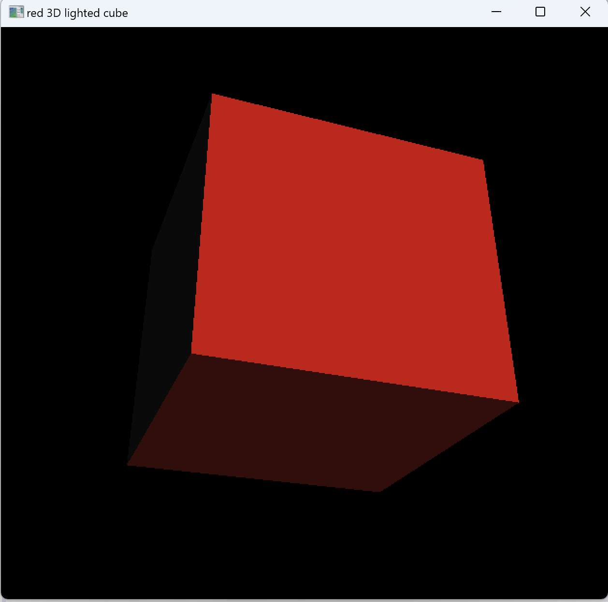
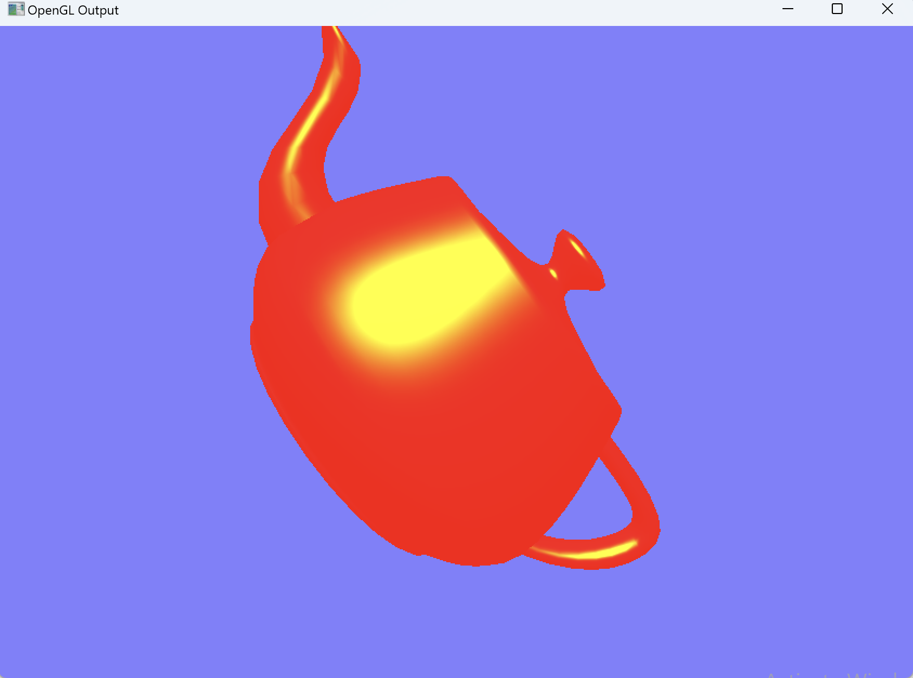
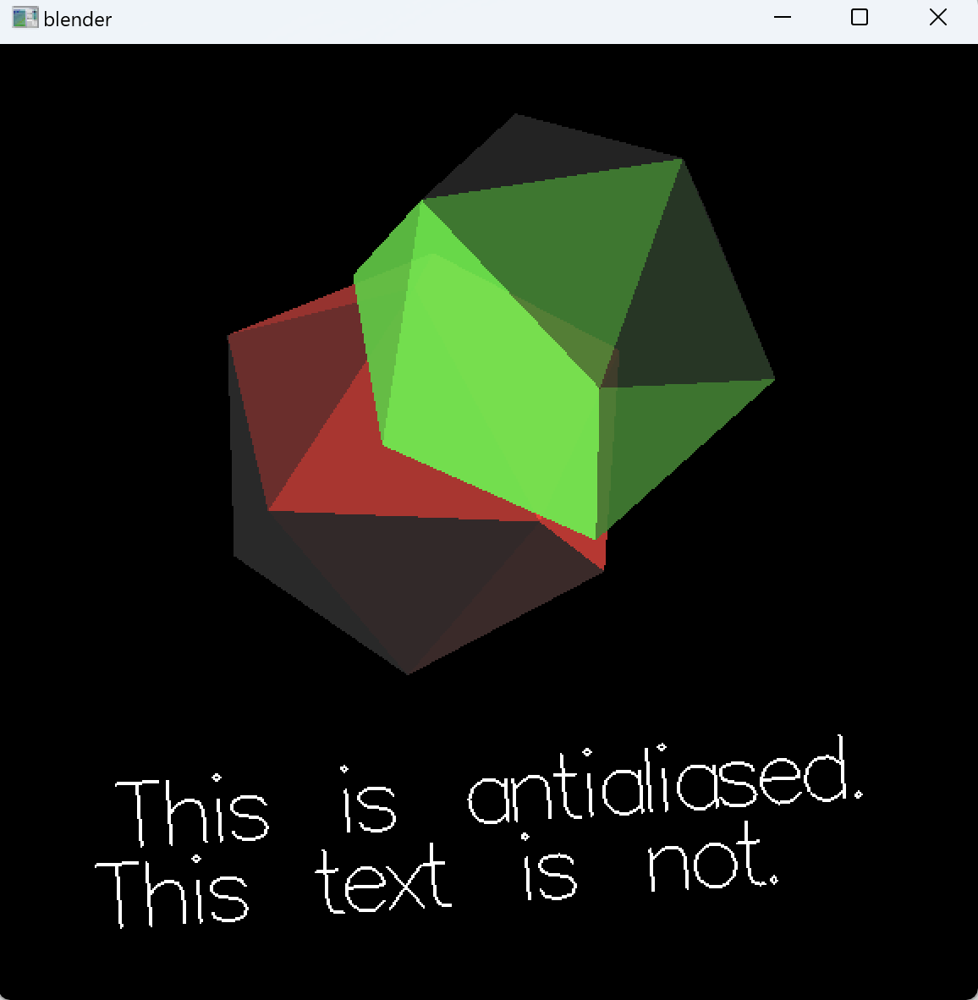
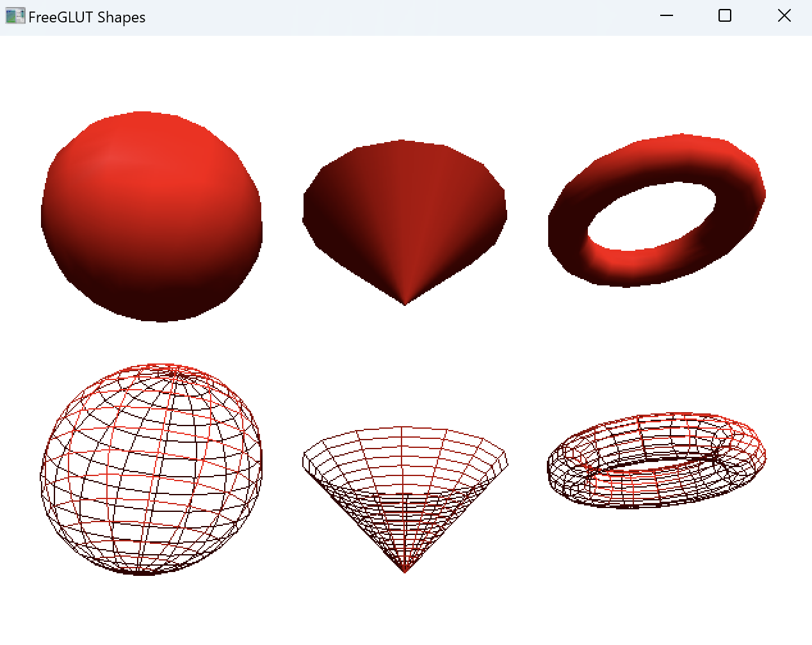

# A1 Report

Author: Jashandeep Singh

Date: 2024-09-16

Check [readme.txt](readme.txt) for course work statement and self-evaluation. 
  
## Q1 Concepts of raster display systems (short answer)

### Q1.1 framebuffers

- Framebuffers is defined as block of memory in RAM allocated to store image data in raster pattern.

### Q1.2 pixels, color depth, and resolution

- <strong>Pixels:</strong> Also known as Picture Element or Dot, is the smallest unit of display on a digital screen or image.

- <strong>Color Depth:</strong> Color Depth refers to number of bits allocated to store data of each pixel. it could be 1 bit, 8 bits, 16 bits or 24 bits. 

- <strong>Resolution:</strong> Resolution refers to total number of pixels. Represent as product of number of pixels in each row and total number of rows.
	- eg: 720 x 460, where 720 represents number of pixels in each row and 460 is total number of rows.

### Q1.3 Frame, refreshment, and refresh rate

- <strong>Frame:</strong>An image in the frame buffer is read by video controller and displayed on screen, Frame refers to a full scan and display of image on screen.

- <strong>Refreshment:</strong> The process of reshresing the frame to display new images in called Resfreshment.
- <strong>Refresh Rate:</strong> Refresh Rate is defined as the frequency at which frames are refreshed at screen to display new image.

## Q2 Concepts of image rendering (short answer)

### Q2.1 What are the two basic image rendering approaches?

There two image rendering approaches widely used:

 - <strong>Rasterizarion:</strong> It refers to the process of computing and setting value of pixels in framebuffer for each object that the image is composed of.

 - <strong>Ray Tracing:</strong> It refers to the processing of casting a ray from light from veiwers prespective and calculating the color of object where the ray hits and then assinging the value to corresponding pixel in the framebuffer.

### Q2.2 Why rasterization is commonly used in graphics applications?

Raterization has been go to approach in graphics applications due to its efficiency and suitability for real-time rendering:

 - It is faster as compared to ray tracing and lesser resource intensity making it ideal for real time graphics.
- It seperates the process of generating and displaying images, avoiding the displaying of incomplete images.

## Q3 Roles of CPU and GPU in CG (short answer)

### Q3.1 CPU roles

CPU handles the model computation and sends the object data which includes details like object geometry (vertices, polygons), textures, transformations (position, rotation, scale), and any other relevant parameters. CPU then sends this object data along with other instructions on how process and render the objects to GPU.

to GPU along with instructions.

### Q3.2 GPU roles
GPU is an independent, self contained hardware device dedicated for rendering graphics. Using the data provided by the CPU, the GPU process the data and rasterized it, that is converts it to pixel data. The converted pixel data is then stored in framebuffer to be displayed on device by video controller.

## Q4 C/C++ OpenGL programming environment (lab practice)

### Q4.1 C/C++ OpenGL installation 

Complete? Yes or No 

<!--If you answer Yes, insert a screenshot image to show the completion.-->

{width=90%}

{width=90%}

<!-- If No, add a short description to describe the issues encountered.-->

### Q4.2 OpenGL C project 

Complete? Yes or No 

<!--If you answer Yes, insert a screenshot image to show the completion.-->

{width=90%}

<!-- If No, add a short description to describe the issues encountered.-->

### Q4.3 OpenGL C++ project 

Complete? Yes or No 

<!--If you answer Yes, insert a screenshot image to show the completion.-->

{width=90%}

<!-- If No, add a short description to describe the issues encountered.-->

**References**

1. CP411 a1
2. CP411 Lecture notes
3. Caulfield, B. (2020, May 21). What’s the difference between ray tracing, rasterization?|
<a href="https://blogs.nvidia.com/blog/whats-difference-between-ray-tracing-rasterization/#:~:text=Real%2Dtime%20computer%20graphics%20have,what%20ray%20tracing%20can%20do. 
"> NVIDIA Blog.</a>
4. GPU vs CPU - Difference Between Processing Units - AWS. (n.d.). <a href="https://aws.amazon.com/compare/the-difference-between-gpus-cpus/#:~:text=A%20CPU%2C%20or%20central%20processing,hardware%20component%20but%20more%20specialized">Amazon Web Services, Inc</a>
 